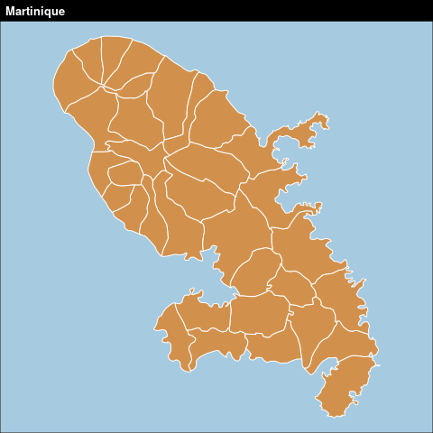
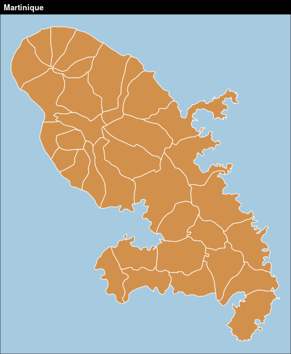

<!-- ```{r knitr3_init, echo=FALSE, cache=FALSE} -->
<!-- library(knitr) -->
<!-- ## Global options -->
<!-- options(max.print="90") -->
<!-- opts_chunk$set(echo=TRUE, -->
<!--                cache=FALSE, -->
<!--                prompt=FALSE, -->
<!--                tidy=FALSE, -->
<!--                comment=NA, -->
<!--                message=FALSE, -->
<!--                warning=FALSE, -->
<!--                fig.align='center', -->
<!--                fig.height=6,  -->
<!--                fig.width=5,  -->
<!--                sm=TRUE) -->
<!-- opts_knit$set(width=90) -->
<!-- options(width = 90) -->
<!-- ``` -->


# La mise en page  {#chapitre3}


<!-- Pour être finalisée, une carte thématique doit contenir certains éléments aditionnels tels que : le titre, l'auteur, la source, l'échelle, l'orientation... -->

<!-- ## Les thèmes -->

<!-- ## Les titres -->


<!-- ## Flèche d'orientation -->

<!-- La fonction `north()` permet de mieux choisir la position et l'aspect de la flèche d'orientation.  -->

<!-- ```{r north} -->
<!-- plot(st_geometry(mtq), col = "#D1914D", border = "white") -->
<!-- mf_arrow(pos = "topleft", col = "#D1914D") -->
<!-- # layoutLayer(title = "Martinique", sources = "IGN",  -->
<!-- #             author = "Giraud & Pécout, 2019", frame = FALSE, scale = 5, -->
<!-- #             coltitle = "#D1914D",tabtitle = TRUE, postitle = "right") -->
<!-- ``` -->

<!-- Par défaut, la flèche d'orientation pointe vers le haut de la figure. Il est possible, avec l'argument `x`, d'utiliser une couche de référence pour indiquer le nord géographique.  -->

<!-- ```{r north2} -->
<!-- mtq_proj <- st_transform(mtq, 2154) -->
<!-- plot(st_geometry(mtq_proj), col = "#D1914D", border = "white") -->
<!-- mf_arrow(pos = "topright", col = "#D1914D",adjust = mtq_proj) -->
<!-- # mf_layout() -->
<!-- # layoutLayer(title = "Martinique", sources = "IGN",  -->
<!-- #             author = "Giraud & Pécout, 2019", frame = FALSE, scale = 5, -->
<!-- #             coltitle = "#D1914D",tabtitle = TRUE, postitle = "left") -->
<!-- ``` -->


<!-- ## Échelle -->

<!-- La fonction `barscale()` permet de mieux choisir la position et l'aspect de l'échelle.  -->

<!-- ```{r scale} -->
<!-- plot(st_geometry(mtq), col = "#D1914D", border = "white") -->
<!-- mf_scale( -->
<!--   size = 5,  -->
<!--   lwd = 2,  -->
<!--   cex = 1.2,  -->
<!--   pos = c(713712.6,1594777) -->
<!-- ) -->
<!-- # layoutLayer(title = "Martinique", sources = "IGN",  -->
<!-- #             author = "Giraud & Pécout, 2019", scale = NULL, -->
<!-- #             coltitle = "#D1914D",tabtitle = TRUE) -->
<!-- ``` -->


<!-- ## Crédits -->


<!-- ## Habillage complet -->

<!-- La fonction `layoutLayer()` permet d'afficher tous ces éléments.  -->

<!-- ```{r layout1} -->
<!-- plot(st_geometry(mtq), col = "lightblue4", border = "lightblue3",  -->
<!--      bg = "lightblue1") -->
<!-- mf_layout( -->
<!--   title = "Martinique",  -->
<!--   credits = "IGN\nGiraud & Pécout, 2019", -->
<!--   arrow = TRUE -->
<!-- ) -->
<!-- ``` -->

<!-- Plusieurs arguments permettent de paramétrer plus finement les éléments d'habillage pour aboutir à des cartes plus personnalisées (`tabtitle`, `col`, `coltitle`, `theme`...). -->

<!-- ```{r layout2} -->
<!-- plot(st_geometry(mtq), col = "lightblue4", border = "lightblue3",  -->
<!--      bg = "lightblue1") -->
<!-- # layoutLayer( -->
<!-- #   title = "Martinique",  -->
<!-- #   sources = "IGN",  -->
<!-- #   author = "Giraud & Pécout, 2019", -->
<!-- #   north = TRUE,  -->
<!-- #   scale = 5, -->
<!-- #   frame = FALSE,  -->
<!-- #   tabtitle = TRUE,  -->
<!-- #   theme = "turquoise.pal" -->
<!-- # ) -->
<!-- ``` -->


<!-- ## Annotations -->


<!-- ## Les légendes -->


<!-- ## Étiquettes -->

<!-- La fonction `labelLayer()` est dédiée à l'afichage d'étiquettes.  -->

<!-- ```{r labs} -->
<!-- plot(st_geometry(mtq), col = "darkseagreen3", border = "darkseagreen4",  -->
<!--      bg = "#A6CAE0") -->
<!-- mf_label( -->
<!--   x = mtq,  -->
<!--   var = "LIBGEO",  -->
<!--   col= "black",  -->
<!--   cex = 0.7,  -->
<!--   font = 4, -->
<!--   halo = TRUE,  -->
<!--   bg = "white",  -->
<!--   r = 0.1,  -->
<!--   overlap = FALSE, lines = FALSE -->
<!-- ) -->
<!-- # layoutLayer(title = "Communes", tabtitle = TRUE, author = "INSEE, 2016",  -->
<!-- #             sources ="", north =TRUE, frame = FALSE, scale = 5) -->
<!-- ``` -->

<!-- L'argument `halo = TRUE` permet d'afficher un leger halo autour des étiquettes et l'argument `overlap = FALSE` permet de créer des étiquettes ne se recouvrant pas.   -->


<!-- ## Ajuster les marges d'une figure -->

<!-- Pour modifier les marges d'une figure (carte ou autre) il faut utiliser la fonction `par()` qui défini certains paramètres graphiques des figures et son argument `mar`.  -->
<!-- La fonction `dev.off()` efface tous les graphiques en mémoire et permet de réinitialiser les valeurs par défaut. -->

<!-- ```{r defmarg, dm=TRUE} -->
<!-- # Modification de la couleur de fond des graphique -->
<!-- par(bg="grey90") -->
<!-- plot(st_geometry(mtq), main="Marges par défaut") -->
<!-- # Modification des marges -->
<!-- par(mar=c(0,0,1.2,0)) -->
<!-- plot(st_geometry(mtq), main="Marges paramétrées") -->
<!-- ``` -->


<!-- ## Centrer la carte sur une région -->

<!-- ```{r} -->
<!-- # Extract Fort-de-France municipality -->
<!-- fdf <- mtq[9,] -->
<!-- mf_init(x = fdf, theme = "iceberg") -->
<!-- mf_map(mtq, add = TRUE) -->
<!-- mf_map(fdf, col = NA, border = "red", lwd = 2, add = TRUE) -->
<!-- mf_layout() -->
<!-- ``` -->


<!-- ## Afficher plusieurs cartes sur la même figure -->

<!-- Il faut ici utiliser l'argument `mfrow` de la fonction `par()`. Le premier chiffre représente le nombre lignes et le deuxième le nombre de colonnes.  -->


<!-- ```{r mfrow0, fig.height=2.5, eval = F} -->
<!-- # deux lignes et deux colonnes -->
<!-- par(mfrow=c(2,2)) -->
<!-- plot(st_geometry(mtq), col="red") -->
<!-- plot(st_geometry(mtq), col="blue") -->
<!-- plot(st_geometry(mtq), col="green") -->
<!-- plot(st_geometry(mtq), col="yellow") -->
<!-- ``` -->


<!-- ```{r mfrow, fig.height=2.5, eval = F} -->
<!-- # une ligne et deux colonnes -->
<!-- par(mfrow=c(1,2), mar = c(0,.2,1.2,.2)) -->
<!-- # 1ere carte -->
<!-- carbet_bb <- st_bbox(carbet) -->
<!-- plot(st_geometry(mtq), col = "darkseagreen1", border = "darkseagreen4",  -->
<!--      xlim = carbet_bb[c(1,3)], ylim = carbet_bb[c(2,4)], bg = "#A6CAE0") -->
<!-- plot(st_geometry(carbet), col = "darkseagreen3", border = "darkseagreen4",  -->
<!--      lwd = 2, add=TRUE) -->
<!-- layoutLayer(title = "Le Carbet", sources = "", author = "", scale = 1,  -->
<!--             tabtitle = TRUE, frame=FALSE) -->
<!-- # 2eme carte  -->
<!-- plot(st_geometry(mtq), col = "darkseagreen1", border = "darkseagreen4",  -->
<!--      xlim = diams_bb[c(1,3)], ylim = diams_bb[c(2,4)], bg = "#A6CAE0") -->
<!-- plot(st_geometry(diams), col = "darkseagreen3", border = "darkseagreen4",  -->
<!--      lwd = 2, add=TRUE) -->
<!-- layoutLayer(title = "Le Diamant", sources = "", author = "", scale = 1,  -->
<!--             tabtitle = TRUE, frame=FALSE) -->

<!-- ``` -->


<!-- ```{r mfrow2, fig.width=3, eval = F} -->
<!-- # une ligne et deux colonnes -->
<!-- par(mfrow=c(2,1), mar = c(0.2,0,1.4,0)) -->
<!-- # 1ere carte -->
<!-- carbet_bb <- st_bbox(carbet) -->
<!-- plot(st_geometry(mtq), col = "darkseagreen1", border = "darkseagreen4",  -->
<!--      xlim = carbet_bb[c(1,3)], ylim = carbet_bb[c(2,4)], bg = "#A6CAE0") -->
<!-- plot(st_geometry(carbet), col = "darkseagreen3", border = "darkseagreen4",  -->
<!--      lwd = 2, add=TRUE) -->
<!-- layoutLayer(title = "Le Carbet", sources = "", author = "", scale = 1,  -->
<!--             tabtitle = TRUE, frame=FALSE) -->
<!-- # 2eme carte  -->
<!-- plot(st_geometry(mtq), col = "darkseagreen1", border = "darkseagreen4",  -->
<!--      xlim = diams_bb[c(1,3)], ylim = diams_bb[c(2,4)], bg = "#A6CAE0") -->
<!-- plot(st_geometry(diams), col = "darkseagreen3", border = "darkseagreen4",  -->
<!--      lwd = 2, add=TRUE) -->
<!-- layoutLayer(title = "Le Diamant", sources = "", author = "", scale = 1,  -->
<!--             tabtitle = TRUE, frame=FALSE) -->
<!-- ``` -->

<!-- ## Export des cartes -->


<!-- Il est assez difficile d'exporter des figures (cartes ou autres) dont le ratio hauteur/largeur soit satisfaisant. Le ratio par défaut des figure au format png est de 1 (480x480 pixels) :  -->

<!-- ```{r, eval=FALSE} -->
<!-- png(filename = "img/martinique1.png", res = 96) -->
<!-- par(mar = c(0,0,1.2,0), bg = "grey90") -->
<!-- plot(st_geometry(mtq), bg = "#A6CAE0", col = "#D1914D", border = "white") -->
<!-- # layoutLayer(title = "Martinique", sources = "", author = "", scale = NULL) -->
<!-- dev.off() -->
<!-- ``` -->
<!--  -->

<!-- Sur cette carte beaucoup d'espace est perdu à l'est et à l'ouest de l'ile.  -->

<!-- La fonction `getFigDim()` de `cartography` permet de choisir un ratio hauteur/largeur correspondant à l'emprise d'un objet `sf` en prenant en compte une largeur (ou hauteur) fixée, les paramètres de marges et la résolution souhaitée.  -->

<!-- ```{r} -->
<!-- # getFigDim(x = mtq, width = 480, mar = c(0,0,1.2,0), res = 96) -->
<!-- ``` -->

<!-- ```{r, eval=FALSE} -->
<!-- png(filename = "img/martinique2.png", width = 480, height = 583, res = 96) -->
<!-- par(mar = c(0,0,1.2,0), bg = "grey90") -->
<!-- plot(st_geometry(mtq), bg = "#A6CAE0", col = "#D1914D", border = "white") -->
<!-- # layoutLayer(title = "Martinique", sources = "", author = "", scale = NULL) -->
<!-- dev.off() -->
<!-- ``` -->
<!--  -->

<!-- L'emprise de cette carte est exactement celle de l'île.  -->

<!-- ## Ajouter une image sur une carte  -->
<!-- Cela peut être utile pour ajouter un logo, un pictogramme. La fonction `readPNG()` du package `png` permet l'ajout d'images sur une figure. -->

<!-- ```{r logo} -->
<!-- mf_theme("green") -->
<!-- library(png) -->
<!-- # import de l'image -->
<!-- logo <- readPNG("img/mapmonster.png") -->
<!-- # dimension de l'image en unité de la carte -->
<!-- pp <- dim(logo)[2:1] * 16  -->
<!-- # Définition d'un point d'encrage de l'image dans la figure, ici -->
<!-- # le coin inférieur gauche de la bounding box de la martique. -->
<!-- xy <- st_bbox(mtq)[1:2] -->
<!-- mf_map(mtq, col = "#D1914D", border = "white") -->
<!-- rasterImage( -->
<!--   image   = logo,  -->
<!--   xleft   = xy[1],  -->
<!--   ybottom = xy[2],  -->
<!--   xright  = xy[1] + pp[1],  -->
<!--   ytop    = xy[2] + pp[2] -->
<!-- )  -->
<!-- mf_layout() -->
<!-- ``` -->


<!-- ## Placer précisément un élément sur la carte -->

<!-- La fonction `locator()` permet de cliquer sur une figure et d'obtenir les coordonnées d'un point dans le système de coordonnées de la figure (de la carte).  -->

<!-- <video width="800" controls="controls"> -->
<!-- <source src="img/locator.webm" type="video/webm" /> -->
<!-- </video> -->

<!-- ```{r} -->
<!-- mf_map(mtq, col = "darkseagreen3", border = "darkseagreen4",  -->
<!--      bg = "#A6CAE0") -->
<!-- text(x = 694019-10000, y = 1615161,  -->
<!--      labels = "MER\nDES\nCARAÏBES",  -->
<!--      col = "#e3f1f9", font = 3, srt=20) -->
<!-- box() -->
<!-- ``` -->

<!-- `locator()`peut être utilisée sur la plupart des graphiques (pas ceux produits avec `ggplot2`).  -->


<!-- ```{block2, type='linky'} -->
<!-- [How to interactively position legends and layout elements on a map with cartography](https://rgeomatic.hypotheses.org/1837) -->
<!-- ``` -->


<!-- ## Ajouter un ombrage à une couche -->
<!-- ```{r shadow} -->
<!-- mf_shadow(mtq, col = "grey50") -->
<!-- mf_map(mtq, col="darkseagreen3", border="darkseagreen4", add=TRUE) -->
<!-- mf_layout(title = "Communes", credits= "INSEE, 2016", arrow = FALSE,  -->
<!--           scale = TRUE, frame = FALSE)   -->
<!-- ``` -->


<!-- ## Création de cartons -->

<!-- ```{r inset} -->
<!-- fdf <- mtq[9,] -->
<!-- mf_init(x = fdf, theme = "agolalight", expandBB = c(0,0,0,.5)) -->
<!-- mf_map(mtq, add = TRUE) -->
<!-- mf_map(fdf, col = NA, border = "red", lwd = 2, add = TRUE) -->
<!-- mf_inset_on(x = mtq, pos = "topright", cex = .33) -->
<!-- mf_map(mtq) -->
<!-- mf_map(fdf, col = NA, border = "red", lwd = 2, add = TRUE) -->
<!-- mf_scale(size = 5, pos = "bottomleft", cex = .6, lwd = .5) -->
<!-- mf_inset_off() -->
<!-- mf_layout(frame = TRUE) -->
<!-- ``` -->


