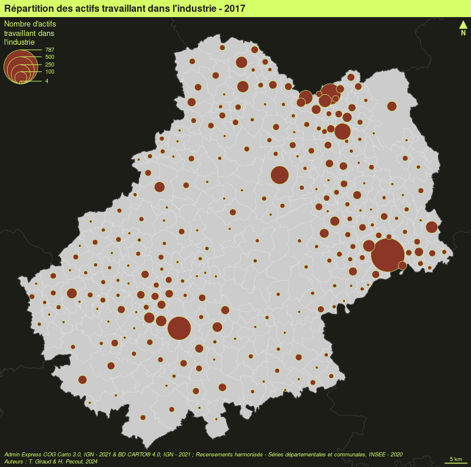
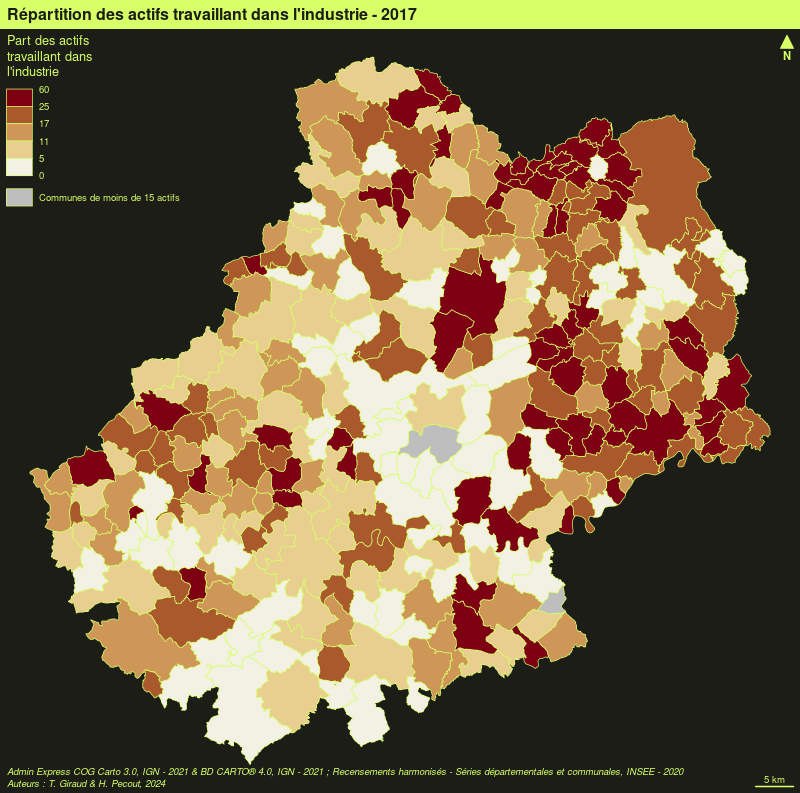
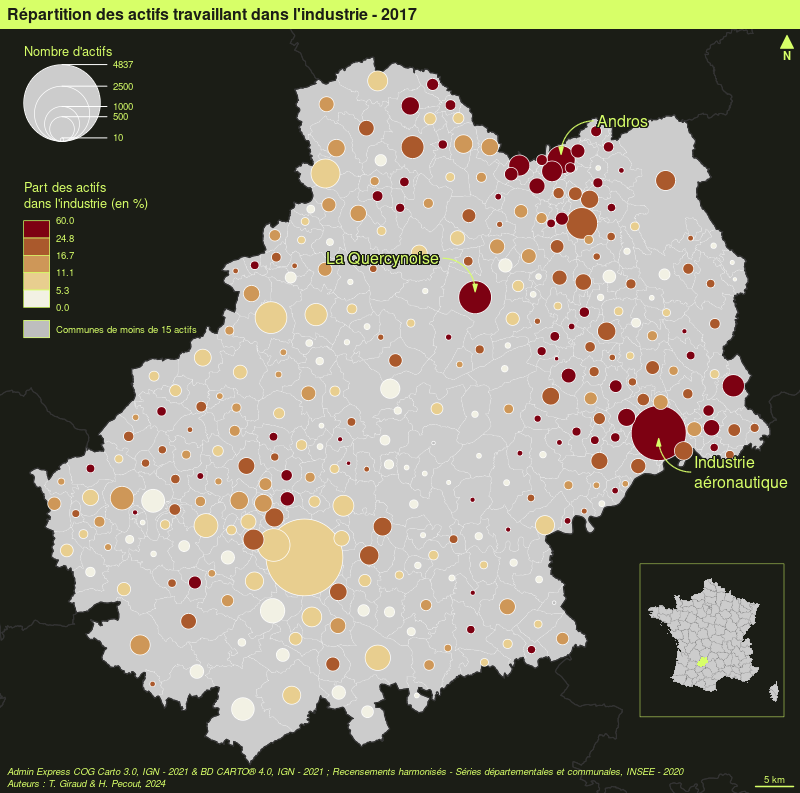

```{r knitr3_init, echo=FALSE, cache=FALSE}
library(knitr)
## Global options
options(max.print="90")
opts_chunk$set(echo=TRUE,
               cache=TRUE,
               prompt=FALSE,
               tidy=FALSE,
               comment=NA,
               message=FALSE,
               warning=FALSE,
               fig.align='center',
               fig.height=5,
               fig.width=5,
               sm=TRUE)
opts_knit$set(width=90)
options(width = 90)
```


# La mise en page 

Pour être finalisée, une carte thématique doit contenir certains éléments additionnels tels que : le titre, l'auteur, la source, l'échelle, l'orientation...


## Les données d'exemple

Les lignes suivantes importent les couches d'information spatiales situées dans le fichier [geopackage](https://www.geopackage.org/) **lot46.gpkg**.

```{r}
library(sf)
# import des communes du Lot
com <- st_read("data/lot46.gpkg", layer = "commune", quiet = TRUE)
# import des départments français
dep <- st_read("data/lot46.gpkg", layer = "departement", quiet = TRUE)
# import des restaurants
resto <- st_read("data/lot46.gpkg", layer = "restaurant", quiet = TRUE)
# import des routes
route <- st_read("data/lot46.gpkg", layer = "route", quiet = TRUE)
```

## Les thèmes

La fonction `mf_theme()` défini un thème cartographique. L'utilisation d'un thème permet de définir plusieurs paramètres graphiques qui sont ensuite appliqués aux cartes créées avec `mapsf`. Ces paramètres sont : les marges de la carte, la couleur principale, la couleur de fond, la position et l'aspect du titre. Un thème peut également être défini avec les fonctions `mf_init()` et `mf_export()`.

### Utiliser un thème prédéfini

Une série de thèmes prédéfinis est disponible par défaut (voir `?mf_theme`).

```{r them1, fig.show='hold', fig.width =8, fig.height = 8}
library(mapsf)
# utilisation d'une couleur de fond pour la figure, pour voir l'utilisation des marges
opar <- par(mfrow = c(2,2))
# Utilisation d'un thème prédéfini
mf_theme("default")
mf_map(com)
mf_title("Theme : 'default'")
mf_theme("darkula")
mf_map(com)
mf_title("Theme : 'darkula'")
mf_theme("candy")
mf_map(com)
mf_title("Theme : 'candy'")
mf_theme("nevermind")
mf_map(com)
mf_title("Theme : 'nevermind'")
par(opar)

```

### Modifier un thème existant

Il est possible de modifier un thème existant. Dans cet exemple, nous utilisons le thème "default" et nous en modifions quelques paramètres.

```{r theme2, fig.width = 8, fig.height = 4, fig.show='hold'}
library(mapsf)
opar <- par(mfrow = c(1,2))
mf_theme("default")
mf_map(com)
mf_title("default")
mf_theme("default", tab = FALSE, font = 4, bg = "grey60", pos = "center")
mf_map(com)
mf_title("modified default")
par(opar)
```


### Créer un thème


Il est également possible de créer un thème.


```{r}
mf_theme(
  bg = "lightblue",    # couleur de fond
  fg = "tomato1",      # couleur principale
  mar = c(0,0,1.5,0),  # marges
  tab = FALSE,         # style "onglet" pour le titre
  inner = FALSE,       # titre à l'intérieur de la zone de carte ou à l'extérieur
  line = 1.5,          # espace dédié au titre
  pos = "center",      # position du titre
  cex = 1.2,           # taille du titre
  font = 2             # type de fonte pour le titre
)
mf_map(com)
mf_title("New theme")
```


## Les titres

La fonction ``mf_title()` permet d'ajouter un titre à une carte.


```{r}
mf_theme("default")
mf_map(com)
mf_title("Titre de la carte")
```


Il est possible de personnaliser l'aspect du titre.

```{r}
mf_map(com)
mf_title(
  txt = "Titre de la carte", 
  pos = "center", 
  tab = FALSE, 
  bg = "tomato3", 
  fg = "lightblue", 
  cex = 1, 
  line = 1.2, 
  font = 1, 
  inner = FALSE
)
```


## Flèche d'orientation

La fonction `mf_arrow()` permet de choisir la position et l'aspect de la flèche d'orientation.

```{r north}
mf_map(com)
mf_arrow()
```


## Échelle

La fonction `mf_scale()` permet de choisir la position et l'aspect de l'échelle.

```{r scale}
mf_map(com)
mf_scale(
  size = 20,
  lwd = 2,
  cex = 1.2,
)
```


## Crédits

La fonction `mf_credits()` permet d'afficher une ligne de crédits (sources, auteur...).
```{r credit}
mf_map(com)
mf_credits("IGN\nGiraud & Pécout, 2021")
```


## Habillage complet

La fonction `mf_layout()` permet d'afficher tous ces éléments.

```{r layout1}
mf_map(com)
mf_layout(
  title = "Martinique",
  credits = "IGN\nGiraud & Pécout, 2021",
  arrow = TRUE
)
```


## Annotations


```{r}
mf_map(com)
mf_annotation(com[com$NOM_COM == "Cahors",], txt = "Cahors", halo = TRUE, cex = 1.5)
```


## Les légendes


```{r}
mf_map(com)
mf_legend(
  type = "prop", 
  val = c(1000,500,200,10), 
  inches = .4, 
  title = "Population", 
  pos = "topleft"
)
mf_legend(
  type = "choro", 
  val = c(0,10,20,30,40),
  pal = "Greens", 
  pos = "bottomright", 
  val_rnd = 0
)


```


## Étiquettes

La fonction `mf_label()` est dédiée à l'afichage d'étiquettes.

```{r labs}
com_sel <- com[st_intersects(com, com[com$NOM_COM == "Cahors", ], sparse = F), ]

mf_map(com_sel)
mf_label(
  x = com_sel,
  var = "NOM_COM",
  col= "black",
  halo = TRUE,
  overlap = FALSE, 
  lines = FALSE
)
mf_scale()
```

L'argument `halo = TRUE` permet d'afficher un léger halo autour des étiquettes et l'argument `overlap = FALSE` permet de créer des étiquettes ne se recouvrant pas.


## Centrer la carte sur une région

La fonction `mf_init()` permet d'initialiser une carte en la centrant sur une objet spatial.  

```{r}
mf_init(x = com_sel, theme = "iceberg")
mf_map(com, add = TRUE)
mf_map(com_sel, col = NA, border = "red", lwd = 2, add = TRUE)
```


## Afficher plusieurs cartes sur la même figure

Il faut ici utiliser l'argument `mfrow` de la fonction `par()`. Le premier chiffre représente le nombre lignes et le deuxième le nombre de colonnes.


```{r mfrow0, fig.width=7, fig.height = 3.5,  eval = TRUE}
# define the figure layout (1 row, 2 columns)
par(mfrow = c(1, 2))
# first map
mf_map(com)
mf_map(com, "TER_H", "prop", val_max = 4000)
mf_title("Tertiaire, hommes")
# second map
mf_map(com)
mf_map(com, "TER_F", "prop", val_max = 4000)
mf_title("Tertiaire, femmes")
```

## Export des cartes


Il est assez difficile d'exporter des figures (cartes ou autres) dont le ratio hauteur/largeur est satisfaisant. Le ratio par défaut des figures au format png est de 1 (480x480 pixels) :

```{r, results='hide'}
c2c <- com[com$INSEE_COM == "46138", ]
png("img/c2c1.png")
mf_map(c2c)
mf_title("Cœur de Causse")
dev.off()
```

```{r, echo=FALSE}
knitr::include_graphics("img/c2c1.png")
```
Sur cette carte beaucoup d'espace est perdu au nord et au sud de la commune.

La fonction `mf_export()` permet des exports de cartes dont le ratio hauteur/largeur est contrôlé et correspond à celui d'un objet spatial. 

```{r, results='hide'}
mf_export(c2c, "img/c2c2.png", width = 480)
mf_map(c2c)
mf_title("Cœur de Causse")
dev.off()
```

```{r, echo=FALSE}
knitr::include_graphics("img/c2c2.png")
```
L'emprise de cette carte est exactement celle de la région affichée.


## Ajouter une image sur une carte
Cela peut être utile pour ajouter un logo, un pictogramme. La fonction `readPNG()` 
du package `png` permet l'ajout d'images sur une figure.

```{r logo}
mf_theme("default", mar = c(0,0,0,0))
library(png)
# import de l'image
logo <- readPNG("img/Logo CG 46 - Bleu.png")
# dimension de l'image en unité de la carte
pp <- dim(logo)[2:1] * 20
# Définition d'un point d'encrage de l'image dans la figure, ici
# le coin supérieur gauche de la bounding box du département
xy <- st_bbox(com)[c(1,4)]
mf_map(com, col = "#D1914D", border = "white")
rasterImage(
  image   = logo,
  xleft   = xy[1],
  ybottom = xy[2] - pp[2],
  xright  = xy[1] + pp[1],
  ytop    = xy[2]
)
```


## Placer précisément un élément sur la carte

La fonction `locator()` permet de cliquer sur une figure et d'obtenir les coordonnées d'un point dans le système de coordonnées de la figure (de la carte).

<video width="770" controls="controls">
<source src="img/locator.webm" type="video/webm" />
</video>

`locator()`peut être utilisée sur la plupart des graphiques (pas ceux produits avec `ggplot2`).


```{block2, type='linky'}
[How to interactively position legends and layout elements on a map with cartography](https://rgeomatic.hypotheses.org/1837)
```


## Ajouter un ombrage à une couche

La fonction `mf_shadow()` permet de créer une ombre à une couche de polygones. 
```{r shadow}
mf_shadow(com)
mf_map(com, add=TRUE)

```


## Création de cartons

La fonction `mf_inset_on()` permet de démarrer la création d'un carton.
Il faut ensuite "refermer" le carton avec `mf_inset_off()`.

```{r inset, fig.width = 6.5, fig.height = 5}
mf_init(x = com_sel, theme = "agolalight", expandBB = c(0,.1,0,.5))
mf_map(com, add = TRUE)
mf_map(com_sel, col = "tomato4", border = "tomato1", lwd = 2, add = TRUE)
# Carton France
mf_inset_on(x = dep, pos = "topright", cex = .3)
mf_map(dep, lwd = .5, border= "grey90")
mf_map(com_sel, col = "tomato4", border = "tomato1", lwd = .5, add = TRUE)
mf_scale(size = 200, pos = "bottomleft", cex = .6, lwd = .5)
mf_inset_off()
# Carton Lot
mf_inset_on(x = com, pos = "bottomright", cex = .3)
mf_map(com, lwd = .5, border= "grey90")
mf_map(com_sel, col = "tomato4", border = "tomato1", lwd = .5, add = TRUE)
mf_scale(size = 20, pos = "bottomright", cex = .6, lwd = .5)
mf_inset_off()
# Carton Monde
mf_inset_on(x = "worldmap", pos = "topleft")
mf_worldmap(com_sel, land_col = "#cccccc",border_col = NA, 
            water_col =  "#e3e3e3", col = "tomato4")
mf_inset_off()
mf_title("Cahors et ses environs")
mf_scale(1, pos = 'bottomleft')

```

## Exercices

1. Créez une carte représentant la population active travaillant dans l'industrie. 
2. Ajoutez les éléments d'habillage indispensables.
3. Utilisez un thème personnalisé.
4. Ajoutez un carton de localisation du Lot
5. Exportez la carte au format PNG avec 800 pixels de large. 
6. Comment rendre la carte plus intelligible ? Allez-y !


```{r exoa, echo=TRUE, eval = TRUE}
library(mapsf)
# import des communes du Lot
com <- st_read("data/lot46.gpkg", layer = "commune", quiet = TRUE)
# import des départments français
dep <- st_read("data/lot46.gpkg", layer = "departement", quiet = TRUE)
# Nombre total d'actifs
com$ACT <- com$AGR_H + com$AGR_F + com$IND_H + com$IND_F + com$BTP_H + 
  com$BTP_F + com$TER_H + com$TER_F
# Nombre d'actifs dans l'industrie
com$IND <- com$IND_F + com$IND_H
# Part des actifs travaillant dans l'industrie
com$PART_ACT_IND <- 100 * com$IND / com$ACT

# Création d'un thème personnalisé
th <- mf_theme("green", mar = c(0,0,1.5,0), pos = "left")

# Cartographie du nombre total de travailleurs de l'industrie
mf_export(com, "img/n_ind.png", theme = th, 
          width = 800)
mf_map(x = com, border = "white", lwd = .2, add = T)
mf_map(x = dep, lwd = 1, col = NA, add = TRUE, lend = 0)
mf_map(x = com, var = "IND", type = "prop",
       leg_title = "Nombre d'actifs\ntravaillant dans\nl'industrie")
mf_title("Répartition des actifs travaillant dans l'industrie - 2017")
mf_scale(5)
mf_arrow(pos = "topright")
# notez l'utilisation ici de paste0() qui permet de concatener des chaines 
# de caractères et de \n qui permet d'aller à la ligne
mf_credits(paste0("Admin Express COG Carto 3.0, IGN - 2021 & ", 
                  "BD CARTO® 4.0, IGN - 2021 ; Recensements harmonisés - ",
                  "Séries départementales et communales, INSEE - 2020\n",
                  "Auteurs : T. Giraud & H. Pecout, 2022"))
dev.off()
```



```{r exob, echo=TRUE, eval = TRUE}
# Cartographie de la part des actifs travaillant dans l'industrie
## Quelle est la forme de la distribution que nous voulons cartographier ?
hist(com$PART_ACT_IND)
boxplot(com$PART_ACT_IND, horizontal = TRUE)
summary(com$PART_ACT_IND)

#### > Seules 2 communes ont 100% de travailleurs dans l'industrie
#### Ces communes ont moins de 15 actifs
# Sélection des communes ayant plus de 15 actifs
com_sel <- com[com$ACT > 15, ]
## Quelle est la forme de cette (nouvelle) distribution
hist(com_sel$PART_ACT_IND)
boxplot(com_sel$PART_ACT_IND, horizontal = TRUE)
summary(com_sel$PART_ACT_IND)

# Creation d'un vecteur contenant les limites de classes en 
# utilisant la méthode des quantiles
bks <- mf_get_breaks(com_sel$PART_ACT_IND, nbreaks = 5,
                     breaks = "quantile")
hist(com_sel$PART_ACT_IND, bks)


mf_export(com, "img/s_ind.png", theme = th, 
          width = 800)
# Cartographie
mf_map(x = com, 
       var = "PART_ACT_IND", 
       type = "choro",
       breaks = bks,         # Utilisation des bornes de classes créées précédement
       leg_val_rnd = 0,      # arrondir les valeurs dans la légende
       pal = "Red-Yellow",   # Utilisation d'une palette de couleur
       leg_title = "Part des actifs\ntravaillant dans\nl'industrie",
       add = TRUE, 
       col_na = "grey",
       leg_no_data = "Communes de moins de 15 actifs") # texte du no data dans la légende
mf_title("Répartition des actifs travaillant dans l'industrie - 2017")
mf_scale(5)
mf_arrow(pos = "topright")
mf_credits(paste0("Admin Express COG Carto 3.0, IGN - 2021 & ", 
                  "BD CARTO® 4.0, IGN - 2021 ; Recensements harmonisés - ",
                  "Séries départementales et communales, INSEE - 2020\n",
                  "Auteurs : T. Giraud & H. Pecout, 2022"))
dev.off()
```



Nous allons maintenant combiner le nombre total d'actifs et la parts des travailleurs de l'industrie. 
```{r exoc, echo=TRUE, eval = TRUE}
mf_export(com, "img/c_ind.png", theme = th, 
          width = 800)
mf_map(x = com, border = "white", lwd = .2, add = T)
mf_map(x = dep, lwd = 1, col = NA, add = TRUE, lend = 0)
mf_map(com, c("ACT", "PART_ACT_IND"), "prop_choro", 
       breaks = bks, 
       pal = "Red-Yellow", 
       inches = .4,
       border = "white", lwd = .7, 
       leg_val_rnd =  c(0,1), 
       leg_pos = c(538000,6442000, 538000, 6424000),  # ici les légendes sont positionnées manuellement
       leg_title = c("Nombre d'actifs*", 
                     "Part des actifs\ndans l'industrie (en %)"), 
       col_na = "grey",
       leg_no_data = "Communes de moins de 15 actifs")
  
# Ajout d'annotations
mf_annotation(x = com[com$NOM_COM=="Biars-sur-Cère",], 
              txt = "Andros", 
              col_arrow = th$fg, halo = T, cex = 1)
mf_annotation(x = com[com$NOM_COM=="Figeac",], 
              txt = "Industrie\naéronautique", 
              col_arrow = th$fg, pos = "bottomright", halo = T, cex = 1)
mf_annotation(x = com[com$NOM_COM=="Gramat",], 
              txt = "La Quercynoise (?)", 
              col_arrow = th$fg, pos = "topleft", s = 1, halo = T, 
              cex = 1)

mf_title("Répartition des actifs travaillant dans l'industrie - 2017")

# ajout d'un carton ->
mf_inset_on(fig = c(.8,0.98,0.1,0.3)) 
mf_map(dep, lwd = .1)
mf_map(com, border = NA, add = T, col = th$fg)
box(col = th$fg, lwd = .5)
mf_inset_off()
# <- fin du carton
mf_scale(5)
mf_arrow("topright")
mf_credits(paste0("Admin Express COG Carto 3.0, IGN - 2021 & ", 
                  "BD CARTO® 4.0, IGN - 2021 ; Recensements harmonisés - ",
                  "Séries départementales et communales, INSEE - 2020\n",
                  "Auteurs : T. Giraud & H. Pecout, 2022"))
dev.off()

```



