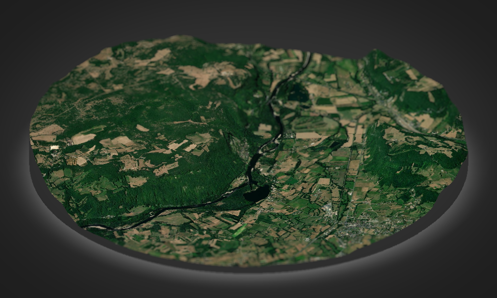

```{r knitr4_init, echo=FALSE, cache=FALSE}
library(knitr)
## Global options
options(max.print="90")
opts_chunk$set(echo=TRUE,
               cache=FALSE,
               prompt=FALSE,
               tidy=FALSE,
               comment=NA,
               message=FALSE,
               warning=FALSE,
               fig.align='center',
               fig.height=7,
               fig.width=7,
               sm=TRUE)
opts_knit$set(width=90)
options(width = 90)

```

# Les cartes en 3D

## linemap

Le package `linemap` [@R-linemap] permet de réaliser des cartes composées de lignes.

```{r linemap}
library(linemap)
library(sf)
library(terra)
library(mapsf)
# import du raster de population
rpop <- rast("data/pop.tif")
# import des communes du Lot
com <- st_read("data/lot46.gpkg", layer = "commune", quiet = TRUE)
com <- st_transform(com, st_crs(rpop))
# découpage selon l'emprise de com
rpop <- trim(mask(rpop, vect(com)))
# transformation en data.frame
pop <- as.data.frame(rpop, xy = TRUE)
pop <- pop[order(pop$y), ]
# cartographie
th <- mf_theme("green")
mf_init(com)
linemap(
  x = pop, 
  var = "Ind", 
  k = 10,
  threshold = 15,
  lwd = 1, 
  col = th$bg, 
  border = th$fg, 
  add = TRUE)
mf_title("Population du Lot, 2015")
mf_credits("Giraud & Pecout, 2021\nINSEE, Données carroyées Filosofi 2015")
```


## Relief Tanaka

Nous utilisons le package `tanaka` [@Tanaka20] qui met à disposition une méthode [@Tanaka50] utilisée pour améliorer la perception du relief.

```{r tanaka}
library(tanaka)
# import du raster de population
rpop <- rast("data/pop.tif")
# import des communes du Lot
com <- st_read("data/lot46.gpkg", layer = "commune", quiet = TRUE)
com <- st_transform(com, st_crs(rpop))
# lissage du raster
mat <- focalMat(x = rpop, d = c(1500), type = "Gauss")
rpopl <- focal(x = rpop, w = mat, fun = sum, na.rm = TRUE)
rpopl <- raster::raster(rpopl)
# cartographie
col1 <- hcl.colors(8, "Rocket", alpha = .3, rev = T)
col2 <- hcl.colors(8, "Rocket", alpha = 1, rev = T)[-1]
mf_theme("agolalight")
mf_init(com)
tanaka(x = rpopl, breaks = c(0,10,25, 50,100,250,500,750, 1972), 
       col = col1, light = NA, dark = NA, add = T, legend.pos = "n")
tanaka(x = rpopl, breaks = c(0,10,25,50,100,250,500,786), 
       col = col2, add = T, mask = com, legend.pos = "n")
mf_legend(type = "choro", pos = "topleft", 
          val = c(0,10,25,50,100,250,500,786), pal = col2, 
          bg = "#EDF4F5", fg = NA, frame = T, val_rnd = 0, 
          title = "Habitants\npar km2")
mf_title("Population lissée du Lot, 2015")
mf_credits("Giraud & Pecout, 2021\nINSEE, Données carroyées Filosofi 2015", 
           bg = "#EDF4F5")
```


```{block2, type = 'linky'}
[The tanaka package](https://rgeomatic.hypotheses.org/1758)
```


## rayshader

Le package `rayshader` [@R-rayshader] permet de réaliser de belles cartes en relief. 
L'export des images n'est pas évident, il s'agit ici d'une simple capture d'écran. 

```{r rayshade,eval=FALSE}
library(rayshader) 
library(rayvista)

zone <- plot_3d_vista(
  lat = 44.9320, long = 1.6905, radius = 4000,
  zscale = 1.5, phi = 30, theta = 120, 
  windowsize = c(1000, 600), 
  baseshape = "circle",
  overlay_detail = 15,
  elevation_detail = 14,
  background = "grey20"
)
png("img/mezels.png", width = 1000, height = 600)
render_camera(zoom = .4)
render_depth(focus = 0.4, focallength = 55, vignette = TRUE)
dev.off()
```

```{r, fig.align='center', echo=FALSE, out.width='100%'}

```