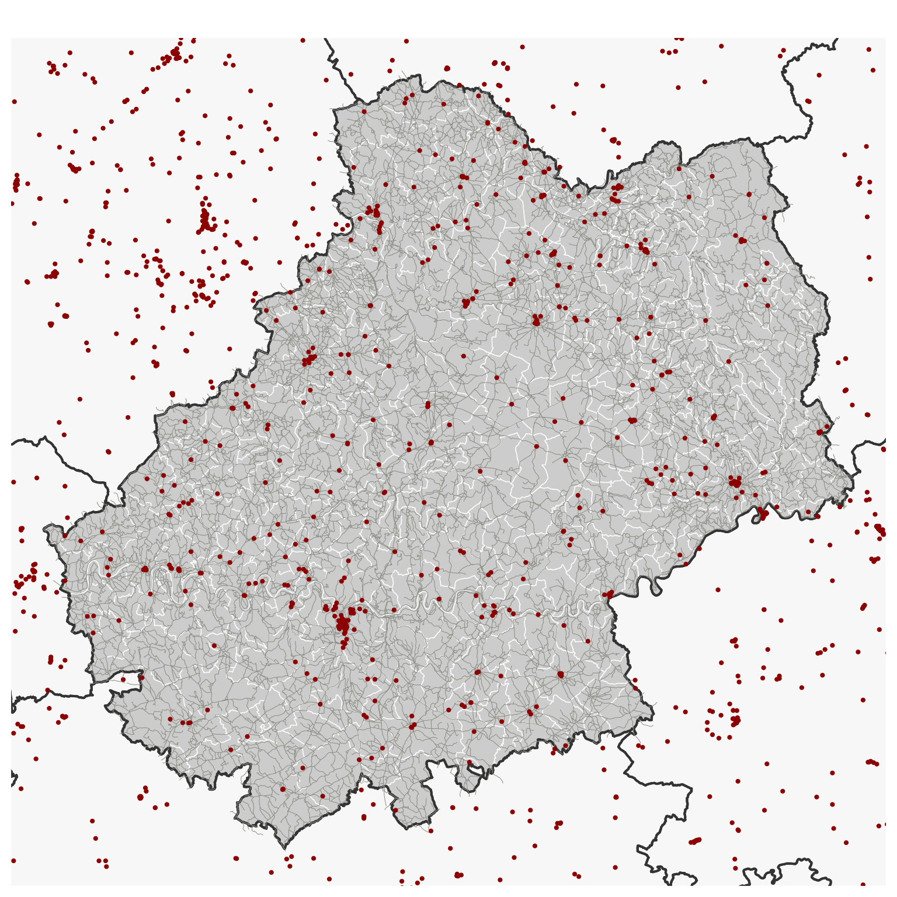
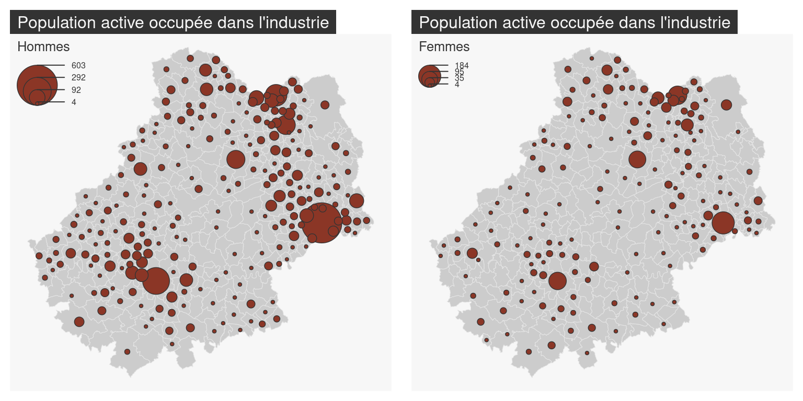
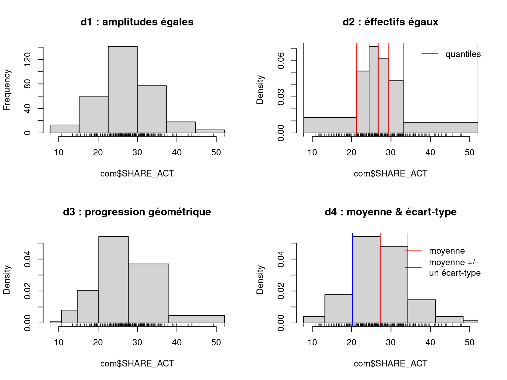
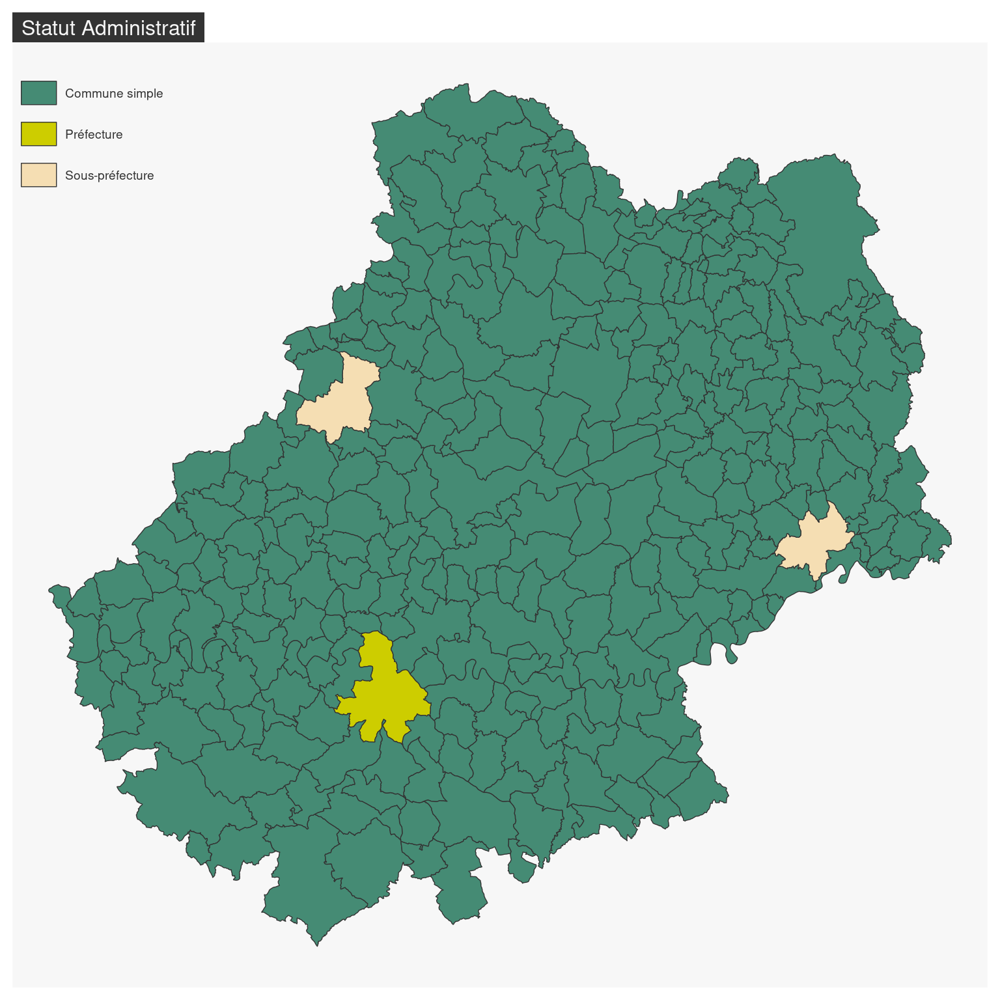
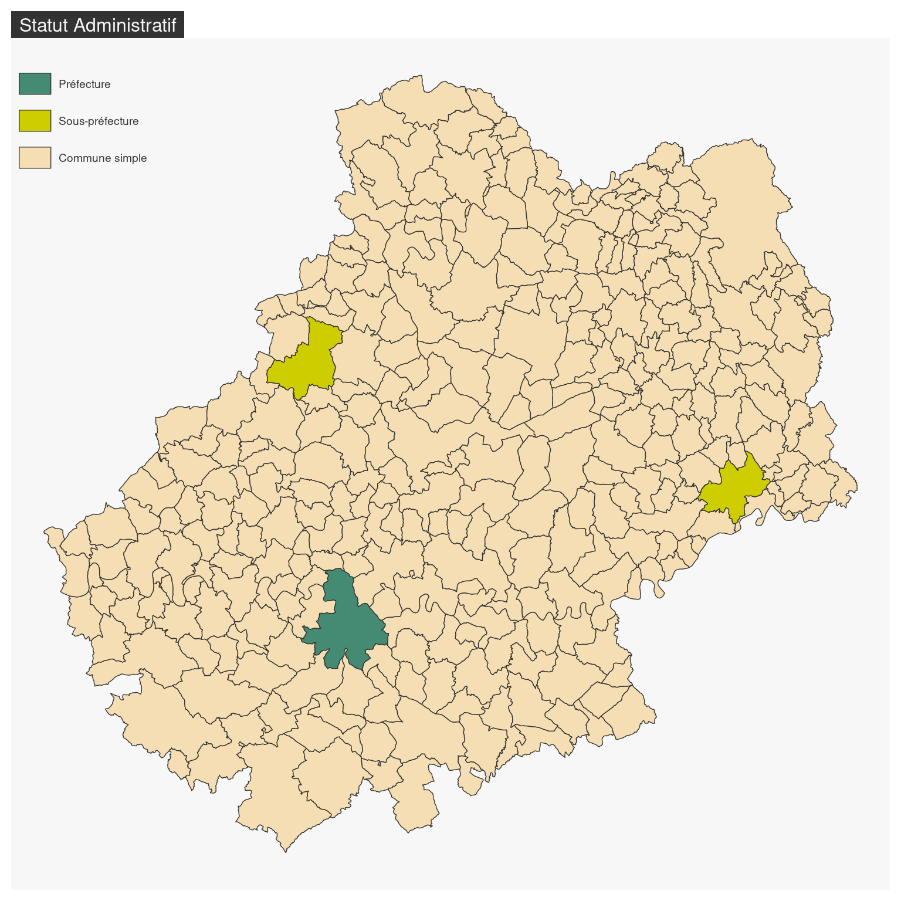

# Les types de cartes  {#chapitre2}

La fonction `mf_map()` est la fonction centrale du package `mapsf`, cette fonction permet de réaliser la plupart des repreésentation usuelles en cartographie. 
Ces arguments principaux sont :

- `x`, un objet sf ;
- `var`, le nom de la variable à représenter ;
- `type`, le type de représentation.

## Les données d'exemple

Les lignes suivantes importent les couches d'information spatiales situées dans le fichier [geopackage](https://www.geopackage.org/) **lot46.gpkg**.


```r
library(sf)
# import des communes du Lot
com <- st_read("data/lot46.gpkg", layer = "commune", quiet = TRUE)
# import des départments français
dep <- st_read("data/lot46.gpkg", layer = "departement", quiet = TRUE)
# import des restaurants
resto <- st_read("data/lot46.gpkg", layer = "restaurant", quiet = TRUE)
# import des routes
route <- st_read("data/lot46.gpkg", layer = "route", quiet = TRUE)
```


## Afficher un fond de carte

Utilisé sans précision de type, la fonction `mf_map()` affiche simplement le fond de carte. 


```r
library(mapsf)
# Communes
mf_map(x = com, border = "white")
mf_map(x = dep, lwd = 2, col = NA, add = TRUE)
mf_map(x = route, lwd = .5, col = "ivory4", add = TRUE)
mf_map(x = resto, pch = 20, cex = .7, col = "darkred", add = TRUE)
```




## Carte de symboles proportionnels

Les cartes de symboles proportionnels sont utilisées pour représenter les variables de stocks (variables quantitatives absolues, la somme et la moyenne ont un sens). 
La fonction `mf_map(..., type = "prop")` propose cette représentation, plusieurs symboles sont disponibles : cercles, carrés. 


```r
# Communes
mf_map(x = com)
# Symboles proportionnels
mf_map(
  x = com, 
  var = "POPULATION",
  type = "prop",
  leg_title = "Population totale\n(2015)"
)
# Titre
mf_title("Distribution de la population dans le Lot")
```


### Comparer plusieurs cartes

Il est possible de fixer les dimensions du plus grand symbole correspondant à une certaine valeur avec les arguments `inches` et `val_max`. Nous pouvons ainsi construire des cartes en symboles proportionnels comparables. 


```r
# Afficher deux cartes en vis à vis
par(mfrow = c(1,2))
# Communes
mf_map(x = com, border = "grey90", lwd = .5)
# Population active occupée dans l'industrie, les hommes
mf_map(
  x = com, 
  var = "IND_H", 
  type = "prop", 
  inches = .2, 
  val_max = 600, 
  leg_title = "Hommes", 
  leg_val_cex = .5,
)
# ajout d'un titre
mf_title("Population active occupée dans l'industrie")

# Communes
mf_map(x = com, border = "grey90", lwd = .5)
# Population active occupée dans l'industrie, les femmes
mf_map(
  x = com, 
  var = "IND_F", 
  type = "prop",
  inches = .2, 
  val_max = 600, 
  leg_title ="Femmes", 
  leg_val_cex = .5
)

# ajout d'un titre
mf_title("Population active occupée dans l'industrie")
```



Nous avons ici affiché deux cartes en vis à vis, voir XXXX pour plus de détails. 


### Les cartes de liens proportionnels

TO DO


## Carte choroplèthe

Les cartes choroplèthes sont utilisées pour représenter les variables de ratios (variables quantitatives relatives, la moyenne a un sens, la somme n'a pas de sens).

Pour ce genre de représentation il faut au préalable :

* choisir une méthode de discrétisation pour transformer une série statistique continue en classes définies par des intervalles,
* choisir un nombre de classes,
* choisir une palette de couleurs.

La fonction `mf_map(..., type = "choro")` permet de créer des cartes choroplètes. Les arguments `nbreaks`, et `breaks` servent à paramétrer les discrétisations et la fonction `mf_get_breaks()` permet de travailler sur les discrétisations en dehors de la fonction `mf_map()`. De même, l'argument `pal` est utilisé pour renseigner une palette de couleur mais plusieurs fonctions peuvent être utilisées pour paramétrer les palettes en dehors de la fonction (`mf_get_pal`...).


```r
# Densité de population (hab./km2) en utilisant la fonction sf::st_area()
com$DENS <- 1e6 * com$POP / as.numeric(st_area(com))
mf_map(
  x = com,
  var = "DENS",
  type = "choro",
  breaks = "quantile",
  pal = "Dark Mint",
  lwd = 1,
  leg_title = "Densité de population\n(habitants par km2)", 
  leg_val_rnd = 0
)
mf_title("Distribution de la population dans le Lot (2018)")
```


### Discrétisations {#discretisation}

La fonction `mf_get_breaks()` met à disposition les méthodes de discrétisations de variables classique : quantiles, moyenn/écart-type, amplitudes égales, moyennes emboitées, Fisher-Jenks, géométrique ...


```r
com$POP_ACT <- com$AGR_H + com$AGR_F + com$IND_H + com$IND_F + com$BTP_H + 
  com$BTP_F + com$TER_H + com$TER_F
com$SHARE_ACT <- 100 * com$POP_ACT / com$POPULATION

d1 <- mf_get_breaks(com$SHARE_ACT, nbreaks = 6, breaks = "equal", freq = T)
d2 <- mf_get_breaks(com$SHARE_ACT, nbreaks = 6, breaks = "quantile")
d3 <- mf_get_breaks(com$SHARE_ACT, nbreaks = 6,  breaks = "geom")
d4 <- mf_get_breaks(com$SHARE_ACT, breaks = "msd", central = FALSE)
```




### Palettes de couleurs {#palettes}

L'argument `pal` de `mf_map()` est dédié au choix d'une palette de couleur. Les palettes fournies par la fonction `hcl.colors()` peuvent être utilisées directement. 


```r
mf_map(x = com, var = "SHARE_ACT", type = "choro", 
       breaks = d4, pal = "Blues 3")
```


```r
knitr::include_graphics("img/swatch-plot-1.svg")
```

<div class="figure" style="text-align: center">

<p class="caption">(\#fig:unnamed-chunk-2)Palettes directement disponibles</p>
</div>

La fonction `mf_get_pal()` permet d'afficher toutes palettes de couleurs disponibles dans `cartography`.
La fonction `carto.pal()` permet de construire une palette de couleur.
Il est possible de créer des palettes associant 2 couleurs.


```r
mypal <- mf_get_pal(n = c(6,3), palette = c("Reds 3", "Greens"))
image(1:9, 1, as.matrix(1:9), col=mypal, xlab = "", ylab = "", xaxt = "n",
      yaxt = "n",bty = "n")
```


## Carte de typologie
Les cartes de typologies sont utilisées pour représenter les variables qualitatives.
La fonction `mf_map(..., type = "typo")` propose cette représentation. 


```r
mf_map(
  x = com,
  var="STATUT",
  type = "typo",
  pal = c("aquamarine4", "yellow3","wheat"),
  lwd = .7,
  leg_title = ""
)
mf_title("Statut Administratif")
```




### Ordonner les valeurs dans la légende

L'argument `val_order` sert à ordonner les modalités dans la légende.


```r
mf_map(
  x = com,
  var="STATUT",
  type = "typo",
  pal = c("aquamarine4", "yellow3","wheat"),
  val_order = c("Préfecture", "Sous-préfecture", "Commune simple"),
  lwd = .7,
  leg_title = ""
)
mf_title("Statut Administratif")
```




### Les cartes de points
Quand l'implantation de la couche est ponctuelle, des symboles sont utilisés pour porter les couleurs de la typologie. 


```r
# extraction des centroids de la préfectures et des sous préfectures
com_ctr <- st_centroid(com[com$STATUT != "Commune simple", ])
mf_map(com)
mf_map(
  x = com_ctr, 
  var = "STATUT", 
  type = "typo", 
  cex = 3, 
  pch = 23, 
  pal = c("aquamarine4", "yellow3"),
  leg_title = "", 
  add = TRUE
)
mf_title("Statut Administratif")
```


### Les cartes de lignes


```r
# Sélection des routes qui intersectent la commune de Cahors
cahors <- com[com$NOM_COM == "Cahors", ]
route_cahors <- route[st_intersects(x = route, y = cahors, sparse = FALSE), ]
mf_map(cahors)
mf_map(
  x = route_cahors, 
  var = "VOCATION", 
  type = "typo", 
  lwd = 2,
  pal = mf_get_pal(n = 4, "Dark 2"),
  leg_title = "Type de route", 
  add = TRUE
)
mf_title("Statut Administratif")
```


<!-- ## Les cartes en symboles gradués -->

<!-- ### Polygons -->

<!-- ### points -->

<!-- ### lignes -->


<!-- ## Les cartes en symboles -->


## Carte de stocks et de ratios
La fonction `mf_map(..., var = c("var1", "var2"), type = "prop_tchoro")` représente des symboles proportionnels dont les surfaces sont proportionnelles aux valeurs d'une variable et dont la couleur repose sur la discrétisation d'une seconde variable. La fonction utilise les arguments des fonctions `mf_map(..., type = "prop")` et `mf_map(..., type = "choro")`.


```r
mf_map(x = com)
mf_map(
  x = com,
  var = c("POPULATION", "DENS"),
  type = "prop_choro",
  border = "grey50",
  lwd = 1,
  leg_pos = c("topright", "topleft"),
  leg_title = c("Population", "Densité\nde population\n(en hab./km2)"),
  breaks = "q6",
  pal = "Magenta",
  leg_val_rnd = c(0,1))
mf_title("Population")
```


## Carte de stocks et de qualitative
La fonction `mf_map(..., var = c("var1", "var2"), type = "prop_typo")` représente des symboles proportionnels dont les surfaces sont proportionnelles aux valeurs d'une variable et dont la couleur représente les modalités d'une variable qualitative. La fonction utilise les arguments des fonctions `mf_map(..., type = "prop")` et `mf_map(..., type = "typo")`.


```r
mf_map(x = com)
mf_map(
  x = com,
  var = c("POPULATION", "STATUT"),
  type = "prop_typo",
  pal = c("aquamarine4", "yellow3","wheat"),
  val_order = c("Préfecture", "Sous-préfecture", "Commune simple"),
  leg_pos = c("bottomleft","topleft"),
  leg_title = c("Population\n(2015)",
                "Statut administratif"),
)
mf_title("Population")
```


<!-- ## Cartes symboles + choro -->

<!-- ## Les cartes raster -->

<!-- `mf_raster()` -->


