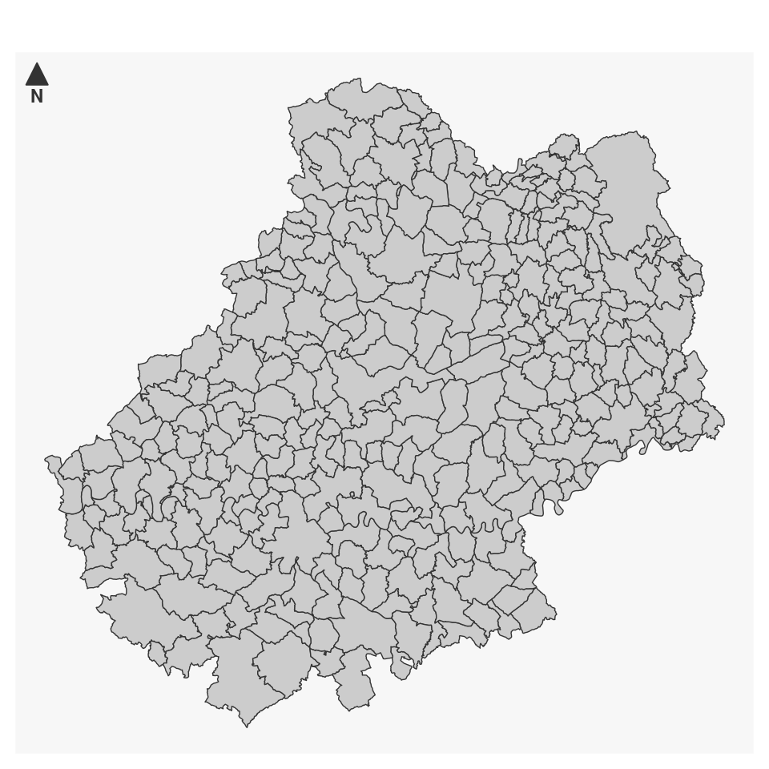
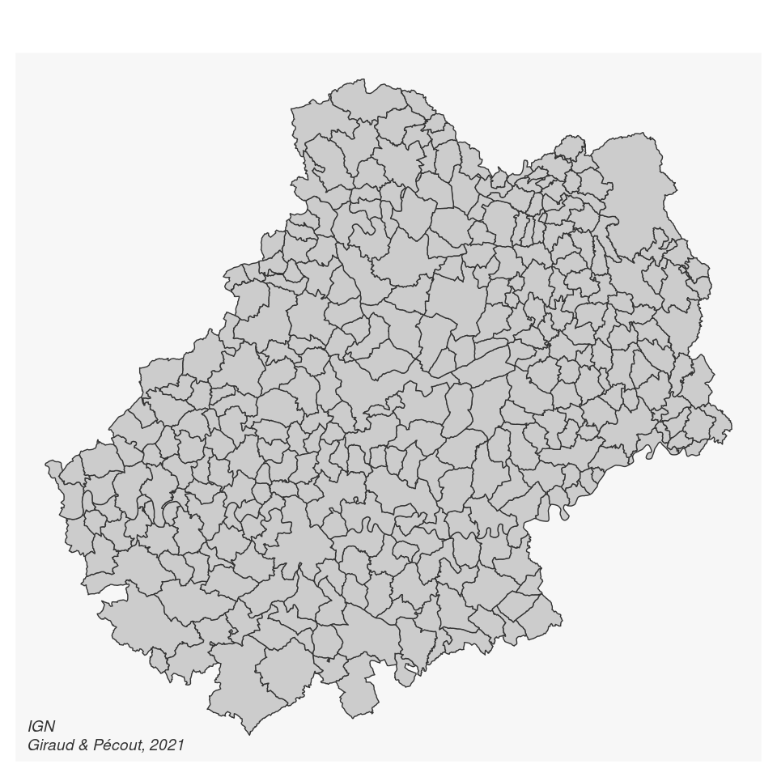
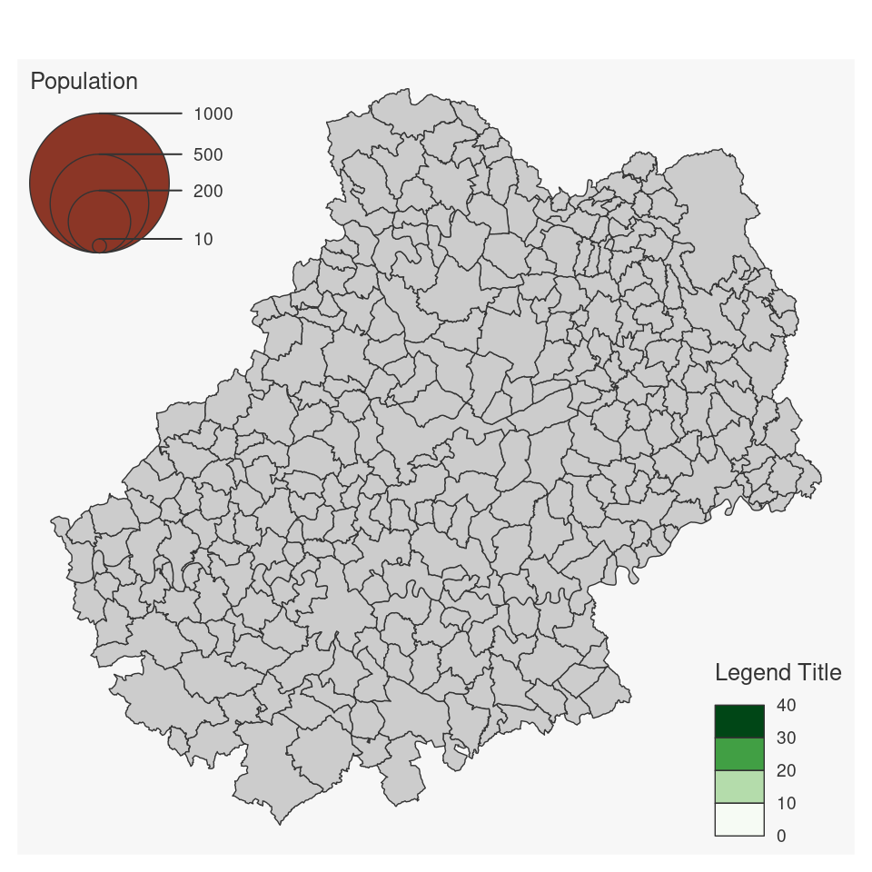
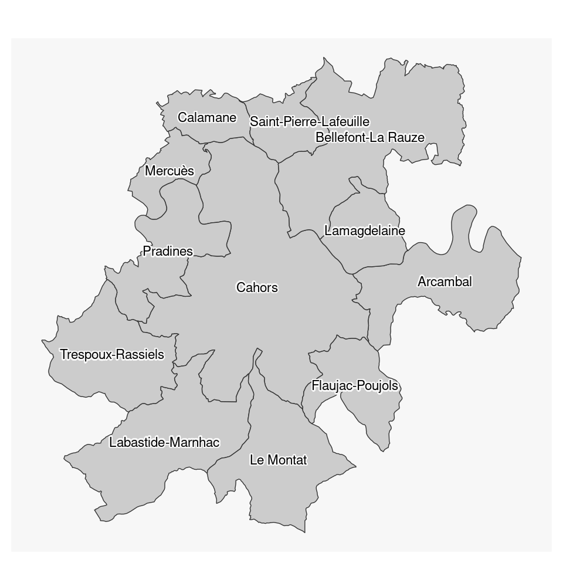
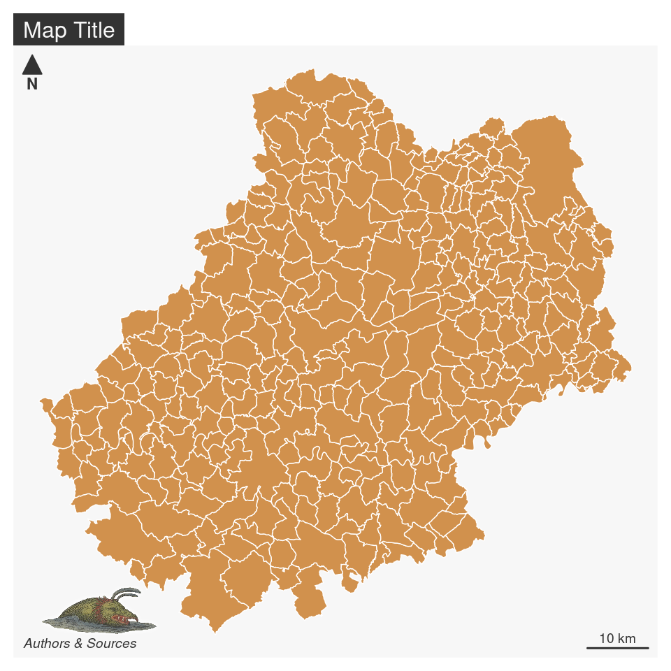
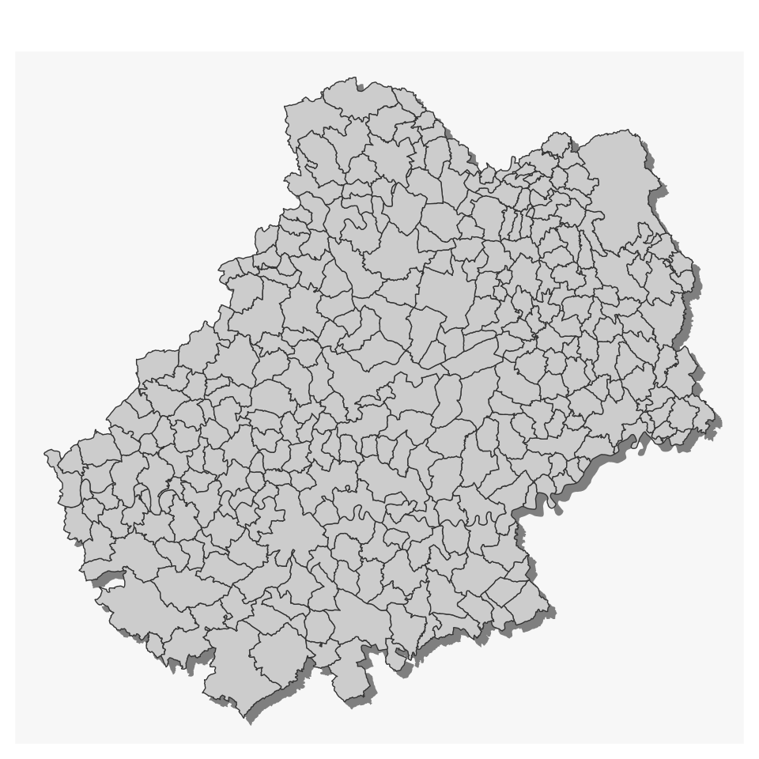

# La mise en page  {#chapitre3}

Pour être finalisée, une carte thématique doit contenir certains éléments aditionnels tels que : le titre, l'auteur, la source, l'échelle, l'orientation...


## Les données d'exemple

Les lignes suivantes importent les couches d'information spatiales situées dans le fichier [geopackage](https://www.geopackage.org/) **lot46.gpkg**.


```r
library(sf)
# import des communes du Lot
com <- st_read("data/lot46.gpkg", layer = "commune", quiet = TRUE)
# import des départments français
dep <- st_read("data/lot46.gpkg", layer = "departement", quiet = TRUE)
# import des restaurants
resto <- st_read("data/lot46.gpkg", layer = "restaurant", quiet = TRUE)
# import des routes
route <- st_read("data/lot46.gpkg", layer = "route", quiet = TRUE)
```

## Les thèmes

La fonction `mf_theme()` défini un thème cartographique. L'utilisation d'un thème permet permet de définir plusieurs paramètres graphiques qui sont ensuite appliqués aux cartes créées avec `mapsf`. Ces paramètres sont : les marges de la carte, la couleur principale, la couleur de fond, la position et l'aspect du titre. Un thème peut également être défini avec les fonction `mf_init()` et `mf_export()`.

### Utiliser un thème prédéfini

Une série de thèmes prédéfinis est disponible par défault (voir `?mf_theme`).


```r
library(mapsf)
# utilisation d'une couleur de fond pour la figure, pour voir l'utilisation des marges
opar <- par(mfrow = c(2,2))
# Utilisation d'un thème prédéfini
mf_theme("default")
mf_map(com)
mf_title("Theme : 'default'")
mf_theme("darkula")
mf_map(com)
mf_title("Theme : 'darkula'")
mf_theme("candy")
mf_map(com)
mf_title("Theme : 'candy'")
mf_theme("nevermind")
mf_map(com)
mf_title("Theme : 'nevermind'")
par(opar)
```


### Modifier un thème existant

Il est possible de modfier un thème existant. Dans cet exemple nous utilisons le thème "default" et nous en modifions quelques paramètres. 


```r
library(mapsf)
opar <- par(mfrow = c(1,2))
mf_theme("default")
mf_map(com)
mf_title("default")
mf_theme("default", tab = FALSE, font = 4, bg = "grey60", pos = "center")
mf_map(com)
mf_title("modified default")
par(opar)
```


### Créer un thème


Il est également possible de créer un theme. 


```r
mf_theme(
  bg = "lightblue",    # couluer de fond
  fg = "tomato1",      # couleur principale
  mar = c(0,0,1.5,0),  # marges
  tab = FALSE,         # style "onglet" pour le titre
  inner = FALSE,       # titre à l'intérieur de la zone de carte ou à l'extérieur
  line = 1.5,          # espace dédié au titre
  pos = "center",      # position du titre
  cex = 1.2,           # taille du titre
  font = 2             # type de font pour le titre
)
mf_map(com)
mf_title("New theme")
```


## Les titres

La fonction ``mf_title()` permet d'ajouter un titre à une carte


```r
mf_theme("default")
mf_map(com)
mf_title("Titre de la carte")
```


Il est possible de personnalisé l'aspect du titre. 


```r
mf_map(com)
mf_title(
  txt = "Titre de la carte", 
  pos = "center", 
  tab = FALSE, 
  bg = "tomato3", 
  fg = "lightblue", 
  cex = 1, 
  line = 1.2, 
  font = 1, 
  inner = FALSE
  )
```


## Flèche d'orientation

La fonction `mf_arrow()` permet de choisir la position et l'aspect de la flèche d'orientation.


```r
mf_map(com)
mf_arrow()
```




## Échelle

La fonction `mf_scale()` permet de choisir la position et l'aspect de l'échelle.


```r
mf_map(com)
mf_scale(
  size = 20,
  lwd = 2,
  cex = 1.2,
)
```


## Crédits

La fonction `mf_credits()` permet d'afficher une ligne de crédits (sources, auteur...).

```r
mf_map(com)
mf_credits("IGN\nGiraud & Pécout, 2021")
```




## Habillage complet

La fonction `mf_layout()` permet d'afficher tous ces éléments.


```r
mf_map(com)
mf_layout(
  title = "Martinique",
  credits = "IGN\nGiraud & Pécout, 2021",
  arrow = TRUE
)
```


## Annotations


```r
mf_map(com)
mf_annotation(com[com$NOM_COM == "Cahors",], txt = "Cahors", halo = TRUE, cex = 1.5)
```


## Les légendes


```r
mf_map(com)
mf_legend(
  type = "prop", 
  val = c(1000,500,200,10), 
  inches = .4, 
  title = "Population", 
  pos = "topleft"
)
mf_legend(
  type = "choro", 
  val = c(0,10,20,30,40),
  pal = "Greens", 
  pos = "bottomright", 
  val_rnd = 0
)
```




## Étiquettes

La fonction `mf_label()` est dédiée à l'afichage d'étiquettes.


```r
com_sel <- com[st_intersects(com, com[com$NOM_COM == "Cahors", ], sparse = F), ]

mf_map(com_sel)
mf_label(
  x = com_sel,
  var = "NOM_COM",
  col= "black",
  halo = TRUE,
  overlap = FALSE, 
  lines = FALSE
)
```



```r
# layoutLayer(title = "Communes", tabtitle = TRUE, author = "INSEE, 2016",
#             sources ="", north =TRUE, frame = FALSE, scale = 5)
```

L'argument `halo = TRUE` permet d'afficher un leger halo autour des étiquettes et l'argument `overlap = FALSE` permet de créer des étiquettes ne se recouvrant pas.


## Centrer la carte sur une région


```r
mf_init(x = com_sel, theme = "iceberg")
mf_map(com, add = TRUE)
mf_map(com_sel, col = NA, border = "red", lwd = 2, add = TRUE)
```


## Afficher plusieurs cartes sur la même figure

Il faut ici utiliser l'argument `mfrow` de la fonction `par()`. Le premier chiffre représente le nombre lignes et le deuxième le nombre de colonnes.


## Export des cartes


Il est assez difficile d'exporter des figures (cartes ou autres) dont le ratio hauteur/largeur soit satisfaisant. Le ratio par défaut des figure au format png est de 1 (480x480 pixels) :


Sur cette carte beaucoup d'espace est perdu à l'est et à l'ouest de l'ile.

L'emprise de cette carte est exactement celle de l'île.

## Ajouter une image sur une carte
Cela peut être utile pour ajouter un logo, un pictogramme. La fonction `readPNG()` du package `png` permet l'ajout d'images sur une figure.


```r
mf_theme("default")
library(png)
# import de l'image
logo <- readPNG("img/mapmonster.png")
# dimension de l'image en unité de la carte
pp <- dim(logo)[2:1] * 16
# Définition d'un point d'encrage de l'image dans la figure, ici
# le coin inférieur gauche de la bounding box de la martique.
xy <- st_bbox(com)[1:2]
mf_map(com, col = "#D1914D", border = "white")
rasterImage(
  image   = logo,
  xleft   = xy[1],
  ybottom = xy[2],
  xright  = xy[1] + pp[1],
  ytop    = xy[2] + pp[2]
)
mf_layout()
```




## Placer précisément un élément sur la carte

La fonction `locator()` permet de cliquer sur une figure et d'obtenir les coordonnées d'un point dans le système de coordonnées de la figure (de la carte).

<video width="800" controls="controls">
<source src="img/locator.webm" type="video/webm" />
</video>


`locator()`peut être utilisée sur la plupart des graphiques (pas ceux produits avec `ggplot2`).


\BeginKnitrBlock{linky}<div class="linky">[How to interactively position legends and layout elements on a map with cartography](https://rgeomatic.hypotheses.org/1837)</div>\EndKnitrBlock{linky}


## Ajouter un ombrage à une couche

```r
mf_shadow(com)
mf_map(com, add=TRUE)
```




## Création de cartons


```r
mf_init(x = com_sel, theme = "agolalight", expandBB = c(0,0,0,.5))
mf_map(com, add = TRUE)
mf_map(com_sel, col = "tomato4", border = "tomato1", lwd = 2, add = TRUE)
mf_inset_on(x = com, pos = "topright", cex = .33)
mf_map(com)
mf_map(com_sel, col = "tomato4", border = "tomato1", lwd = .5, add = TRUE)
mf_scale(size = 10, pos = "bottomright", cex = .6, lwd = .5)
mf_inset_off()
```


