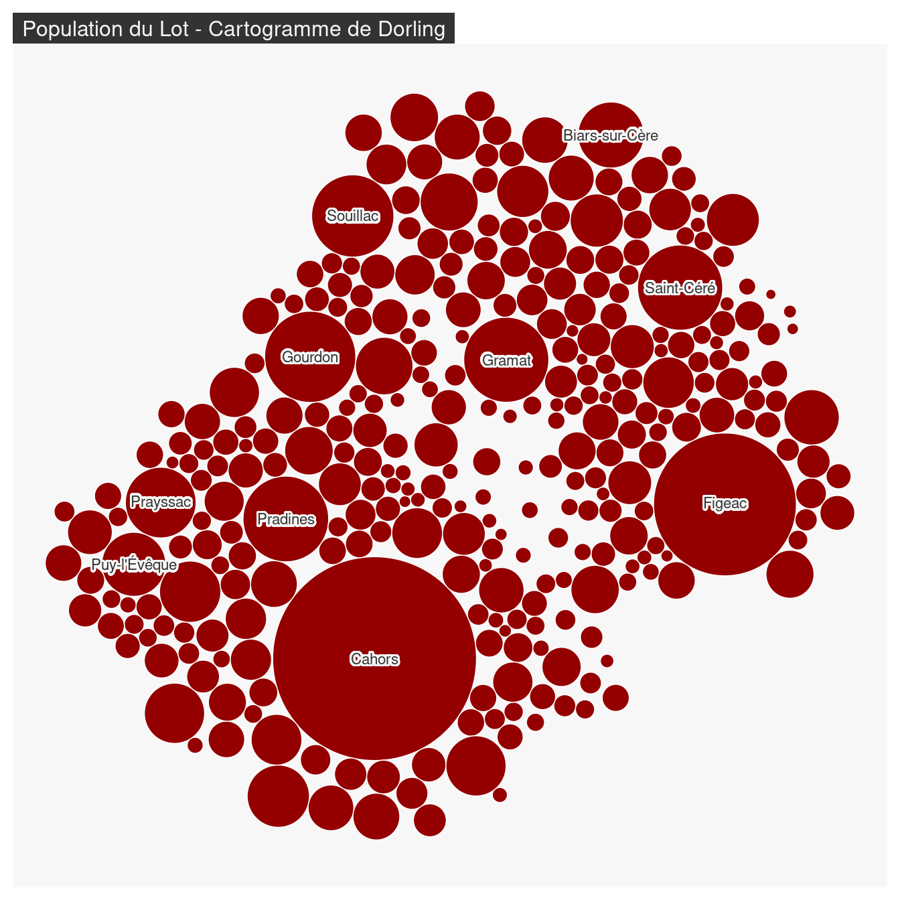
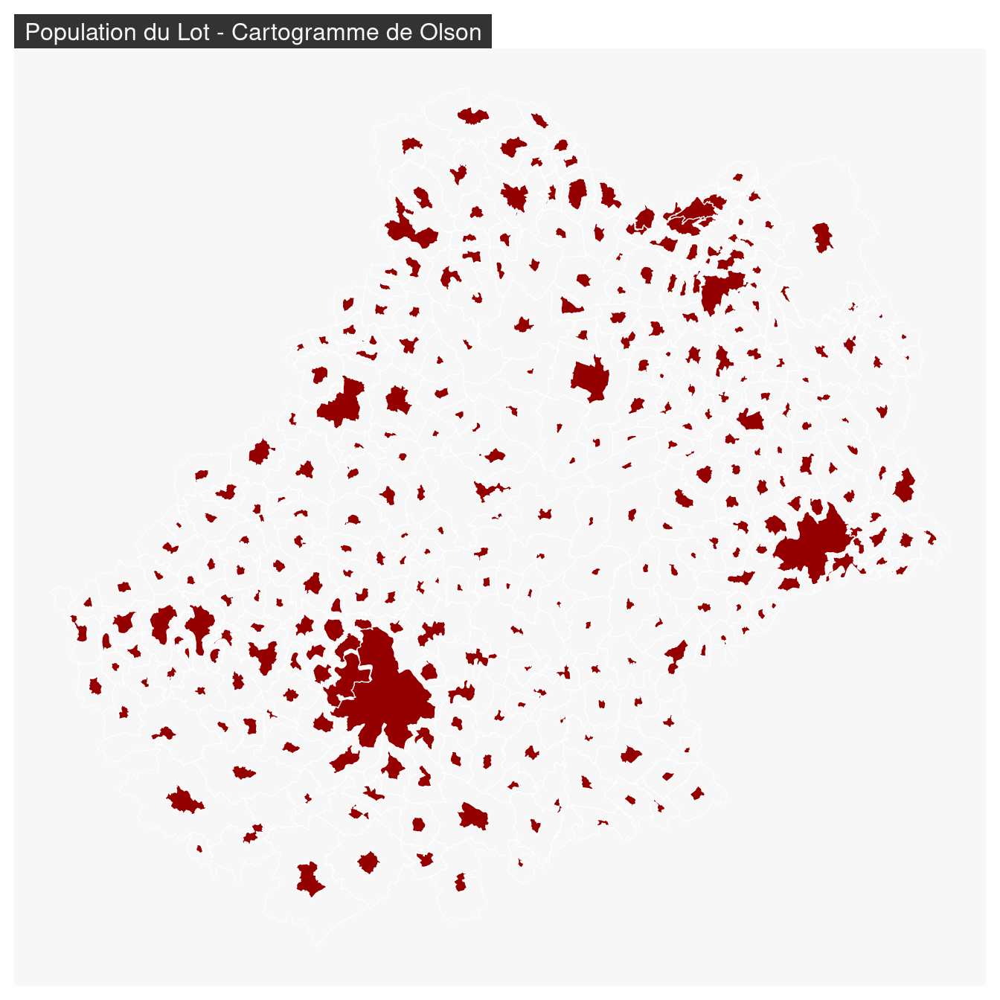
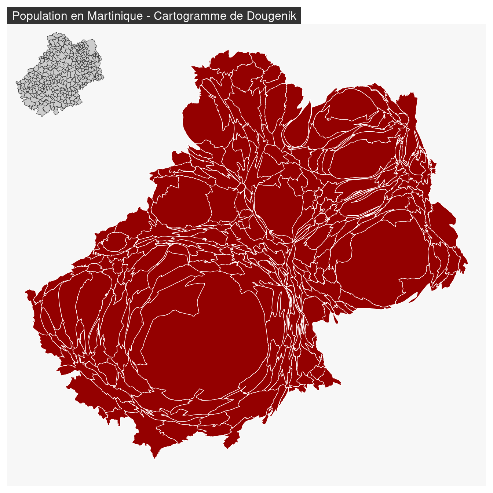

# Les transformations cartographiques
## Les cartogrammes

> L’anamorphose classique est une représentation des États (ou de mailles quelconques) par **des rectangles ou des polygones quelconques** en fonction d’une **quantité** qui leur est rattaché. (...)
> On s’efforce de **garder l’arrangement général** des mailles ou la silhouette du continent."    
> @Brunet93  


3 types d'anamorphoses ou cartogrammes sont ici présentés :

- Les cartogrammes de Dorling [@Dorling96]
- Les cartogrammes non contigus [@Olson76]
- Les cartogrammes contigus [@Dougenik85]


\BeginKnitrBlock{linky}<div class="linky">Un cours complet sur les anamorphoses : [Les anamorphoses cartographiques](https://neocarto.hypotheses.org/366){target="_blank"} [@Lambert15].</div>\EndKnitrBlock{linky}


\BeginKnitrBlock{linky}<div class="linky">[Faire des cartogrammes avec R](https://rgeomatic.hypotheses.org/1361)</div>\EndKnitrBlock{linky}


Pour réaliser les cartogrammes nous utilisons le package `cartogram` [@R-cartogram].

### Les cartogrammes de Dorling

Les territoires sont représentés par des figurés (cercles, des carrés ou des rectangles) ne se recouvrant pas dont les surfaces sont proportionnelles à une variable. Les positions des figurés sont définie selon les positions de départ. 


<div class="figure" style="text-align: center">

<p class="caption">(\#fig:unnamed-chunk-3)@McCormick07</p>
</div>

\BeginKnitrBlock{rmdmoins}<div class="rmdmoins">On identifie assez mal l'espace.  
On peut nommer les cercles pour se repérer et/ou s'aider de la couleur pour faire apparaitre des clusters et mieux identifier les blocks géographiques.    </div>\EndKnitrBlock{rmdmoins}

\BeginKnitrBlock{rmdplus}<div class="rmdplus">La perception des quantités est très bonne.   
Les tailles de cercles sont vraiment comparables.    </div>\EndKnitrBlock{rmdplus}


```r
library(mapsf)
library(cartogram)
com <- st_read("data/lot46.gpkg", layer = "commune", quiet = TRUE)
com_dorling <- cartogram_dorling(x = com, weight = "POPULATION", k = 7)
mf_map(com_dorling, col = "#940000", border= "white")
mf_label(
  x = com_dorling[order(com_dorling$POPULATION, decreasing = TRUE), ][1:10,], 
  var = "NOM_COM",
  overlap = FALSE, show.lines = FALSE,
  halo = TRUE, 
  r = .15
)
mf_title("Population du Lot - Cartogramme de Dorling")
```


Le paramètre `k` permet de faire varier le facteur d'expansion des cercles. 


### Les cartogrammes non continus

La taille des polygones est proportionnelle à une variable. L'agencement des polygones les uns par rapport aux autres est conservée. La forme des polygones est ressemblante. 


[@Cauvin13]

\BeginKnitrBlock{rmdmoins}<div class="rmdmoins">La topologie des régions est perdue.</div>\EndKnitrBlock{rmdmoins}

\BeginKnitrBlock{rmdplus}<div class="rmdplus">La conservation de la forme des polygones est optimale.</div>\EndKnitrBlock{rmdplus}


```r
com_ncont <- cartogram_ncont(x = com, weight = "POPULATION", k = 1.2)
mf_map(com, col = NA, border = "white", lwd = 0.5,)
mf_map(com_ncont, col = "#940000", border= "white", add = TRUE)
mf_title("Population du Lot - Cartogramme de Olson")
```



Le paramètre `k` permet de faire varier le facteur d'expansion des polygones. 


### Les cartogrammes continus


La taille des polygones est proportionnelle à une variable. L'agencement des polygones les uns par rapport aux autres est conservée. Pour conserver la contiguité, la forme des polygones est fortement transformée.  


[@Paull16]

\BeginKnitrBlock{rmdmoins}<div class="rmdmoins">La forme des polygones est fortement distordue.</div>\EndKnitrBlock{rmdmoins}

\BeginKnitrBlock{rmdplus}<div class="rmdplus">C'est une “vraie carte de géographie” : la topologie et la contiguité sont conservées.</div>\EndKnitrBlock{rmdplus}


```r
com_cont <- cartogram_cont(x = com, weight = "POPULATION", prepare = "none")
mf_map(com_cont, col = "#940000", border= "white", add = FALSE)
mf_title("Population en Martinique - Cartogramme de Dougenik")
mf_inset_on(com, cex = .2, pos = "topleft")
mf_map(com, lwd = .5)
mf_inset_off()
```




### Forces et faiblesses des cartogrammes

Les cartogrammes sont des représentations cartographiques perçues comme **innovante** (bien que la methode date de 40 ans). Ces images très généralisées rendent bien compte des **quantités** et des **gradiants**. Ce sont de vraies images de **communication** qui **provoquent**, suscitent **l’intérêt**, véhiculent un **message** fort, **interpellent**.  

Mais les cartogrammes induisent une perte des **repères visuels** (difficile de retrouver son pays, ou sa région sur la carte), demandent un **effort de lecture** qui peut être important et ne permettent pas de **gérer des données manquantes**.   
